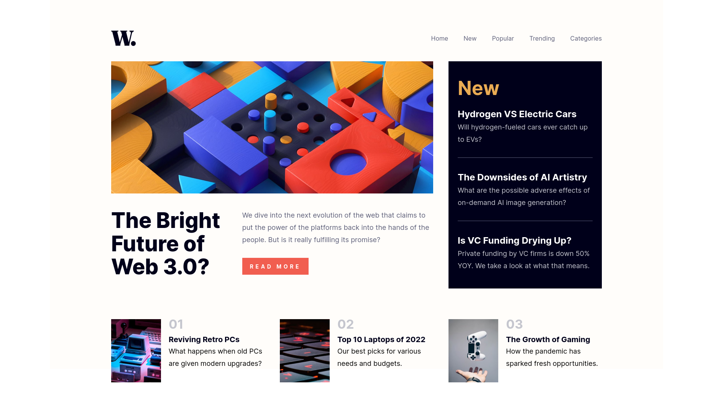
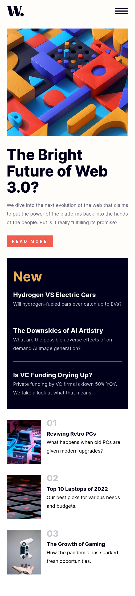

# Frontend Mentor - News homepage solution

This is a solution to the [News homepage challenge on Frontend Mentor](https://www.frontendmentor.io/challenges/news-homepage-H6SWTa1MFl). Frontend Mentor challenges help you improve your coding skills by building realistic projects.

## Table of contents

- [Overview](#overview)
  - [The challenge](#the-challenge)
  - [Screenshot](#screenshot)
  - [Links](#links)
- [My process](#my-process)
  - [Built with](#built-with)
- [Author](#author)

**Note: Delete this note and update the table of contents based on what sections you keep.**

## Overview

### The challenge

Users should be able to:

- View the optimal layout for the interface depending on their device's screen size
- See hover and focus states for all interactive elements on the page

### Screenshot

### Links

- Solution URL: [https://github.com/kbrownw/W-Homepage](https://github.com/kbrownw/W-Homepage)
- Live Site URL: [https://w-homepage.web.app/](https://w-homepage.web.app/)

## My process

### Built with

- Semantic HTML5 markup
- CSS custom properties
- Flexbox
- CSS Grid
- Mobile-first workflow
- [React](https://reactjs.org/) - JS library
- [Vite](https://vitejs.dev/) - Devolopement Environment
- [Typescript](https://www.typescriptlang.org/) - Javascript with syntax for types.
- [TailwindCSS](https://tailwindcss.com/) - For styles
- [FramerMotion](https://www.framer.com/motion/) - For animation

## Author

- LinkedIn - [Keith Brown](https://www.linkedin.com/in/keith-brown-b9a3a32a2/)
- Frontend Mentor - [@kbrownw](https://www.frontendmentor.io/profile/kbrownw)
- Github - [https://github.com/kbrownw](https://github.com/kbrownw)
